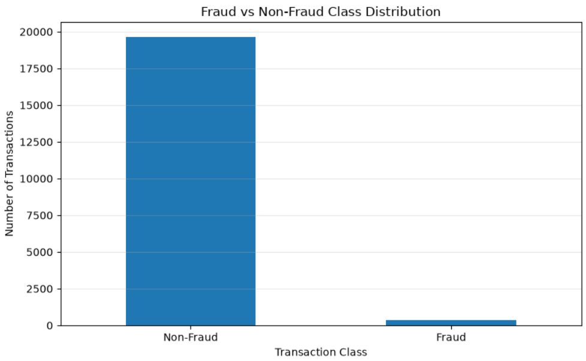
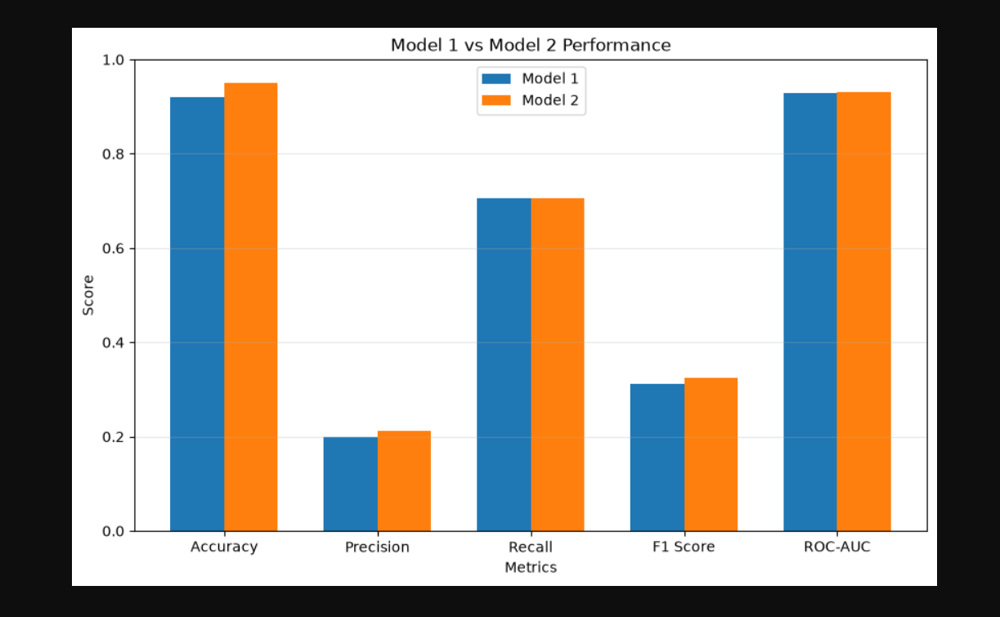
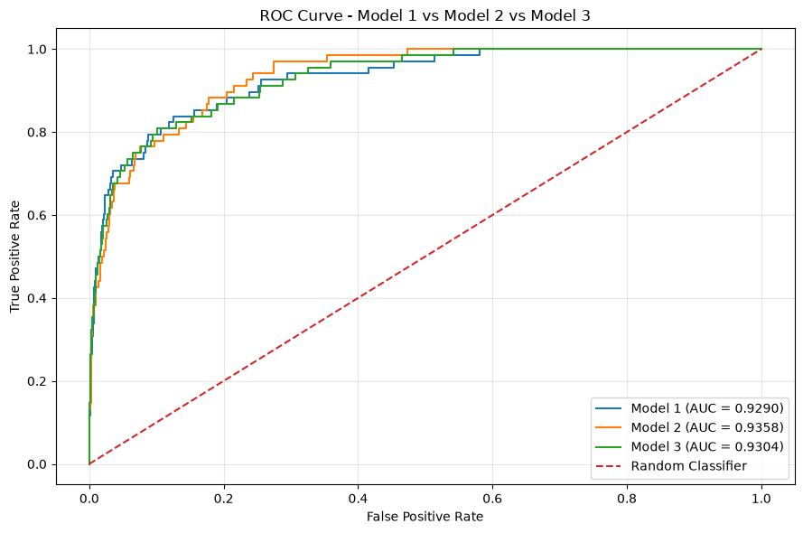
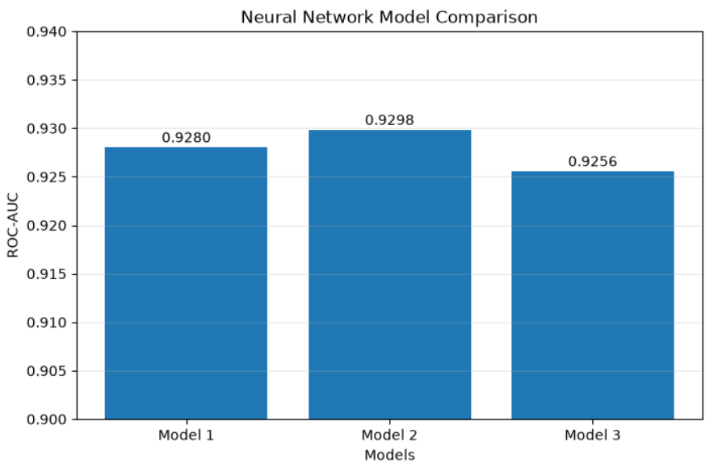
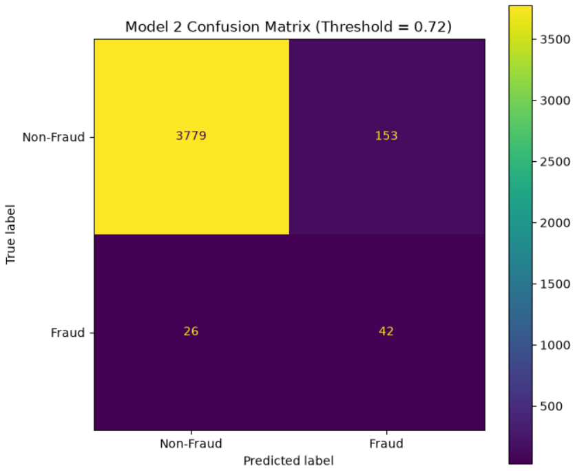
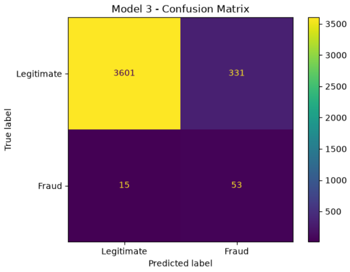
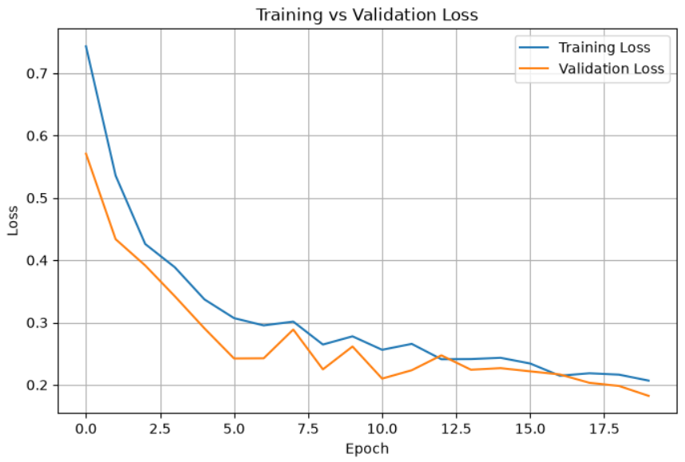
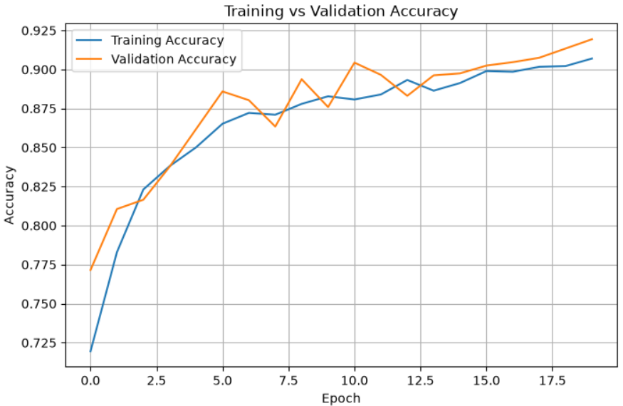
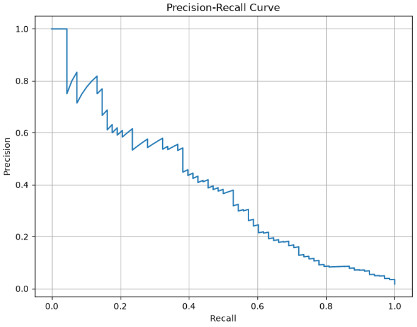

# 🛡️ Neural Network Fraud Detection

An end-to-end **Neural Network-based Fraud Detection project** focused on identifying fraudulent transactions in a highly imbalanced dataset.

This project covers the complete machine learning workflow, from data exploration and preprocessing to neural network training, class imbalance handling, model comparison, ROC-AUC evaluation, and threshold optimization.

Three neural network architectures were developed and evaluated. Based on the current ROC-AUC results, **Model 2 is the leading model and is being taken forward for detailed threshold-based evaluation**.

---

## 💡 Why I Built This Project

Fraud detection is one of the most practical and high-impact applications of machine learning in the real world — banks, fintech companies, and e-commerce platforms lose massive amounts of money every year to fraudulent transactions. I wanted to move beyond textbook classification problems and work on something that mirrors an actual industry use case: **highly imbalanced data, business-critical costs of error, and a need for more than just "accuracy."**

Coming from an MBA in AI & Data Science, I was especially interested in how a technical model like this connects to a real business decision — where should the classification threshold sit, and what does that mean for the business trade-off between blocking fraud and annoying genuine customers?

### 🎯 Objective

The objective of this project was to:

* Build a neural network capable of classifying transactions as **fraudulent** or **legitimate**
* Handle **severe class imbalance** the right way, instead of relying on misleading accuracy scores
* Compare **multiple neural network architectures** and select the best one using proper evaluation metrics (ROC-AUC, Precision, Recall, F1-score)
* Understand how **classification thresholds** affect real-world fraud detection outcomes
* Practice the **complete ML workflow** — EDA, preprocessing, model building, evaluation, and comparison — end-to-end

### ⚠️ The Problem I Faced

The biggest challenge in this project was the **class imbalance** — fraudulent transactions made up a very small percentage of the dataset. This created a few specific problems I had to work through:

* A naive model could report **99%+ accuracy** while completely failing to catch any actual fraud, so accuracy alone was a misleading (and dangerous) metric to optimize for
* Standard training without class weighting caused the model to **heavily favor the majority (non-fraud) class**, pushing recall on fraud cases dangerously low
* Choosing a **single "best" model** wasn't as simple as picking the highest ROC-AUC — I had to also account for how each model performed at different classification thresholds, since the trade-off between Precision and Recall changes the business outcome significantly
* Mixed **numerical and categorical features** (merchant category, card type, auth method, device type, etc.) needed a consistent preprocessing pipeline that could scale and encode everything without leaking information between train and test sets

### 📈 How This Helped / Key Insights

* Using **class weights** during training meaningfully improved the model's ability to detect the minority fraud class, instead of the model just defaulting to predicting "non-fraud" for everything
* **ROC-AUC alone isn't enough** — two models can have very similar ROC-AUC scores (Model 1: 0.928, Model 2: 0.930) but behave very differently at the threshold that actually matters for the business
* **Threshold tuning** showed just how much control there is over the Precision/Recall trade-off *after* training — the same trained model can behave very differently in production depending on where the decision boundary is set
* Building **three separate architectures** and comparing them side-by-side (rather than trusting a single model) reinforced the value of systematic experimentation over guesswork
* This project strengthened my understanding of how a technical modeling decision (like where to set a threshold) directly maps to a **business decision** — how much fraud a company is willing to miss vs. how many genuine customers it's willing to inconvenience

---

## 📌 Project Status

> **Current Status: Model Evaluation & Selection**

The model has **not been deployed** yet.

### Completed

* ✅ Data loading
* ✅ Data exploration
* ✅ Class imbalance analysis
* ✅ Train/test split
* ✅ Numerical/categorical feature identification
* ✅ `ColumnTransformer`
* ✅ `StandardScaler`
* ✅ `OneHotEncoder`
* ✅ 54 processed features
* ✅ Neural network architecture
* ✅ Class weights
* ✅ Model training
* ✅ Model 1
* ✅ Model 2
* ✅ Model 3
* ✅ ROC-AUC evaluation
* ✅ Model comparison
* ✅ Threshold tuning workflow
* ✅ Early stopping
* ✅ Training/validation curves
* ✅ Confusion matrix
* ✅ Precision/Recall/F1 evaluation

### Current Work

* 🔄 Detailed comparison of Model 1 and Model 2
* 🔄 Threshold-based evaluation
* 🔄 Final model selection

### Not Implemented Yet

* ⏳ Model deployment
* ⏳ Prediction API
* ⏳ Streamlit dashboard
* ⏳ Docker containerization
* ⏳ Cloud deployment
* ⏳ Production monitoring

---

# 🎯 Problem Statement

Fraud detection is a challenging binary classification problem because fraudulent transactions are usually a small minority compared with legitimate transactions.

The objective of this project is to develop a neural network that can distinguish between:

```text
0 → Legitimate Transaction
1 → Fraudulent Transaction
```

The main challenge is that a model can achieve high overall accuracy while still failing to detect fraudulent transactions.

For example, if fraudulent transactions represent only a small percentage of the dataset, a model that predicts almost every transaction as legitimate could still achieve high accuracy.

Therefore, this project does not rely on accuracy alone.

The evaluation focuses on:

* ROC-AUC
* Precision
* Recall
* F1-score
* Confusion Matrix
* Precision-Recall Curve
* Classification Threshold

---

# 📊 Dataset

The dataset contains transaction-level information describing transaction behavior, customer characteristics, merchant risk, authentication information, device information, and other fraud-related indicators.

## Features

| Feature                        | Description                                     |
| ------------------------------ | ----------------------------------------------- |
| `transaction_id`               | Unique transaction identifier                   |
| `amount_usd`                   | Transaction amount in USD                       |
| `merchant_category`            | Category of merchant                            |
| `card_type`                    | Type of card used                               |
| `auth_method`                  | Authentication method                           |
| `channel`                      | Transaction channel                             |
| `device_type`                  | Device used for transaction                     |
| `is_foreign_transaction`       | Whether the transaction is foreign              |
| `hours_since_last_txn`         | Hours since the previous transaction            |
| `txn_count_last_24h`           | Number of transactions in the previous 24 hours |
| `distance_from_home_km`        | Distance of transaction from home               |
| `card_age_months`              | Age of the card                                 |
| `customer_age`                 | Age of customer                                 |
| `account_balance_usd`          | Account balance                                 |
| `is_new_merchant`              | Whether the merchant is new                     |
| `used_vpn`                     | Whether a VPN was used                          |
| `ip_country_mismatch`          | IP country mismatch indicator                   |
| `billing_shipping_mismatch`    | Billing/shipping mismatch indicator             |
| `cvv_retry_count`              | Number of CVV retry attempts                    |
| `velocity_score`               | Transaction velocity score                      |
| `time_of_day_hour`             | Hour of transaction                             |
| `day_of_week`                  | Day of transaction                              |
| `is_ai_generated_scam_attempt` | AI-generated scam indicator                     |
| `merchant_risk_score`          | Merchant risk score                             |
| `prior_disputes`               | Number of previous disputes                     |
| `is_fraud`                     | Target variable                                 |

---

# ⚖️ Class Imbalance

One of the most important characteristics of the dataset is the strong imbalance between legitimate and fraudulent transactions.

The target variable is:

```text
is_fraud
```

where:

```text
0 = Non-Fraud
1 = Fraud
```

Because fraudulent transactions are the minority class, the project explicitly analyzes the class distribution before model training.

### Class Distribution



## Why imbalance matters

Consider a hypothetical dataset:

```text
99% → Legitimate
1%  → Fraud
```

A model that predicts every transaction as legitimate would achieve:

```text
Accuracy = 99%
```

but it would detect:

```text
Fraud Recall = 0%
```

Therefore, accuracy alone would provide a misleading picture of model performance.

---

# 🔍 Exploratory Data Analysis

The project begins with exploratory data analysis to understand:

* Dataset dimensions
* Data types
* Missing values
* Numerical features
* Categorical features
* Target distribution
* Fraud vs non-fraud distribution
* Feature behavior
* Potential data quality issues

Visualizations are used to better understand the dataset before preprocessing.

---

# 🧹 Data Preprocessing

The dataset contains both numerical and categorical variables.

A preprocessing pipeline was created using Scikit-learn's `ColumnTransformer`.

## Numerical Features

Numerical features are scaled using:

```python
StandardScaler()
```

Scaling helps the neural network train more effectively by placing numerical variables on comparable scales.

---

## Categorical Features

Categorical features are transformed using:

```python
OneHotEncoder(handle_unknown="ignore")
```

This converts categorical variables into numerical representations that can be passed to the neural network.

---

## ColumnTransformer

The numerical and categorical preprocessing steps are combined using:

```python
ColumnTransformer
```

Conceptually:

```text
                    Dataset
                       │
             ┌─────────┴─────────┐
             │                   │
       Numerical             Categorical
        Features               Features
             │                   │
      StandardScaler      OneHotEncoder
             │                   │
             └─────────┬─────────┘
                       │
                Processed Data
                       │
                 Neural Network
```

After preprocessing, the dataset contains:

```text
54 processed features
```

---

# 🧠 Neural Network

A feed-forward neural network was developed for binary classification.

The general architecture follows:

```text
Input Features
      │
      ▼
Dense Layer
      │
      ▼
Activation
      │
      ▼
Regularization
      │
      ▼
Dense Layer
      │
      ▼
Activation
      │
      ▼
Output Layer
      │
      ▼
Sigmoid
      │
      ▼
Fraud Probability
```

The output layer produces a probability between:

```text
0 and 1
```

This probability is later converted into a fraud/non-fraud prediction using a classification threshold.

---

# ⚖️ Class Weights

Because the dataset is imbalanced, class weights are used during neural network training.

The purpose is to give greater importance to the minority fraud class.

Conceptually:

```text
Non-Fraud → Lower Weight
Fraud     → Higher Weight
```

This encourages the model to pay more attention to fraudulent transactions during training.

---

# 🏋️ Model Training

The neural networks were trained using:

* Training data
* Validation data
* Class weights
* Binary classification loss
* Early stopping

## Early Stopping

Early stopping was implemented to reduce overfitting.

The model monitors validation performance during training and stops training when further training no longer produces meaningful improvement.

This helps prevent the model from unnecessarily learning noise from the training dataset.

---

# 🧪 Multiple Model Architectures

Instead of relying on a single neural network architecture, three models were experimented with.

```text
Model 1
   │
   ├── Train
   └── Evaluate

Model 2
   │
   ├── Train
   └── Evaluate

Model 3
   │
   ├── Train
   └── Evaluate
```

The purpose of creating multiple models was to determine whether changes in the network architecture could improve fraud classification performance.

---

# 📈 Model Comparison

The current ROC-AUC results are:

| Model       |     ROC-AUC | Result          |
| ----------- | ----------: | --------------- |
| Model 1     | **0.92804** | Strong          |
| **Model 2** | **0.92985** | 🏆 Current Best |
| Model 3     | **0.92714** | Not Selected    |

### ROC-AUC Comparison



### ROC Curve



### Final Model Comparison



---

# 🏆 Current Model Selection

Based on the current ROC-AUC results:

```text
Model 2 = 0.92985
Model 1 = 0.92804
Model 3 = 0.92714
```

Model 2 currently has the highest ROC-AUC.

Therefore:

> **Model 2 is currently the leading candidate for the final model.**

However, ROC-AUC is not being used as the only criterion for the final decision.

Models 1 and 2 will also be compared using:

* Precision
* Recall
* F1-score
* Confusion Matrix
* Classification Threshold
* Precision-Recall behavior

This is important because fraud detection is an imbalanced classification problem where the cost of false positives and false negatives can differ significantly.

---

# ❌ Why Model 3 Was Not Taken Forward

Model 3 achieved:

```text
ROC-AUC = 0.92714
```

Compared with:

```text
Model 1 = 0.92804
Model 2 = 0.92985
```

Model 3 did not outperform either of the other two architectures.

Therefore, detailed threshold and classification-metric analysis is currently focused on Models 1 and 2.

This keeps the model-selection process focused on the strongest candidates rather than performing unnecessary additional analysis on a weaker architecture.

---

# 📊 Evaluation Metrics

## ROC-AUC

ROC-AUC measures how effectively the model separates fraudulent and legitimate transactions across different classification thresholds.

Current results:

```text
Model 1 → 0.92804
Model 2 → 0.92985
Model 3 → 0.92714
```

Model 2 currently achieves the highest ROC-AUC.

---

## Precision

Precision answers:

> Of the transactions predicted as fraud, how many were actually fraudulent?

A higher precision means fewer legitimate transactions are incorrectly flagged as fraudulent.

---

## Recall

Recall answers:

> Of all actual fraudulent transactions, how many did the model successfully detect?

Recall is particularly important in fraud detection because false negatives represent fraudulent transactions that were missed.

---

## F1-Score

F1-score provides a balance between Precision and Recall.

It is especially useful when the classes are imbalanced and both types of errors matter.

---

## Confusion Matrix

The confusion matrix provides four outcomes:

```text
                 Predicted
              Non-Fraud   Fraud

Actual
Non-Fraud        TN          FP

Fraud            FN          TP
```

Where:

* `TN` = True Negative
* `FP` = False Positive
* `FN` = False Negative
* `TP` = True Positive

For fraud detection, particular attention is given to `FN`, because these represent fraudulent transactions that were not detected.

### Confusion Matrices by Model

| Model 1 | Model 2 | Model 3 |
| :---: | :---: | :---: |
|  |  |  |

---

# 🎚️ Threshold Tuning

A neural network produces a probability rather than directly producing a fraud/non-fraud label.

For example:

```text
Prediction Probability = 0.73
```

Using the default threshold:

```text
0.50
```

the transaction would be classified as:

```text
Fraud
```

However, the default threshold is not necessarily optimal for fraud detection.

Different thresholds can change the balance between:

```text
Precision ↔ Recall
```

Therefore, threshold tuning is performed for the stronger candidate models.

The goal is to identify a threshold that provides an appropriate balance based on the project's fraud-detection objective.

---

# 🔄 Current Evaluation Strategy

The current evaluation process is:

```text
              Model 1
                 │
                 ▼
        ROC-AUC + Threshold
                 │
       Precision / Recall
                 │
             F1-Score
                 │
                 ▼
             Compare
                 ▲
                 │
       Precision / Recall
                 │
             F1-Score
                 │
        ROC-AUC + Threshold
                 │
                 ▼
              Model 2
```

The final selection will be based on the combined evaluation rather than ROC-AUC alone.

---

# 📉 Training and Validation Curves

Training and validation curves are used to understand how the neural network learns over time.

These curves help identify:

* Overfitting
* Underfitting
* Training stability
* Validation performance
* Appropriate stopping point

### Training and Validation Loss



### Training and Validation Accuracy



---

# 📊 Precision-Recall Curve

The Precision-Recall curve is particularly useful for this project because of the class imbalance.

It demonstrates how precision changes as recall changes across different thresholds.



---

# 📁 Project Structure

```text
Neural-Network-Fraud-Detection/
│
├── Data/
│   └── raw/
│       └── fraud_detection.csv
│
├── Notebook/
│   └── Neural_Network_Fraud_Detection.ipynb
│
├── Models/
│   ├── model_1/
│   ├── model_2/
│   └── model_3/
│
├── Images/
│   ├── class_distribution.png
│   ├── confusion_matrix_model_1.png
│   ├── confusion_matrix_model_2.png
│   ├── confusion_matrix_model_3.png
│   ├── roc_curve.png
│   ├── precision_recall_curve.png
│   ├── training_validation_loss.png
│   ├── training_validation_accuracy.png
│   ├── model_comparison.png
│   └── final_model_comparison.png
│
├── README.md
├── requirements.txt
├── .gitignore
└── LICENSE
```

---

# 🛠️ Technologies Used

## Programming

* Python

## Data Manipulation

* NumPy
* Pandas

## Data Visualization

* Matplotlib
* Seaborn

## Machine Learning

* Scikit-learn

## Deep Learning

* TensorFlow
* Keras

## Development

* Jupyter Notebook

---

# 📦 Installation

Clone the repository:

```bash
git clone https://github.com/anujbhatt30/Neural-Network-Fraud-Detection.git
```

Navigate into the project:

```bash
cd Neural-Network-Fraud-Detection
```

Create a virtual environment:

```bash
python -m venv venv
```

Activate the environment on Windows:

```bash
venv\Scripts\activate
```

Install the required libraries:

```bash
pip install -r requirements.txt
```

---

# ▶️ Running the Project

Start Jupyter Notebook:

```bash
jupyter notebook
```

Open:

```text
Notebook/Neural_Network_Fraud_Detection.ipynb
```

Run the notebook sequentially from data loading through model evaluation.

---

# 📌 Reproducibility

The notebook contains the complete workflow required to reproduce the analysis, including:

1. Data loading
2. Exploratory analysis
3. Train/test split
4. Feature identification
5. Preprocessing
6. Feature transformation
7. Neural network construction
8. Class weighting
9. Model training
10. Model evaluation
11. Model comparison
12. Threshold analysis

Random seeds are used where applicable to improve reproducibility.

---

# 🚀 Future Improvements

The current project focuses on model development and evaluation.

Possible future improvements include:

### Deployment

* Build a prediction API using FastAPI
* Deploy the model using Flask/FastAPI
* Create a Streamlit interface
* Containerize the application with Docker

### Cloud

* AWS deployment
* Cloud-based inference
* Cloud storage for transaction data
* Automated prediction pipeline

### Explainability

* SHAP
* Feature importance analysis
* Individual prediction explanations

### MLOps

* MLflow experiment tracking
* Model versioning
* Model monitoring
* Data drift detection
* Automated retraining

### Advanced Modeling

* Hyperparameter optimization
* XGBoost comparison
* LightGBM comparison
* Ensemble methods
* Advanced neural network architectures

---

# 💼 Business Applications

Fraud detection models can be used in:

* Banking
* Credit card companies
* E-commerce
* Digital payment platforms
* FinTech
* Insurance
* Online marketplaces

A practical fraud detection system must balance two competing objectives:

```text
Detect more fraud
       ↕
Avoid unnecessarily blocking legitimate customers
```

This is why threshold selection and Precision/Recall analysis are important parts of this project.

---

# 🎓 Key Learning Outcomes

This project demonstrates practical experience with:

* End-to-end machine learning workflows
* Imbalanced classification
* Exploratory Data Analysis
* Feature preprocessing
* Numerical feature scaling
* Categorical feature encoding
* `ColumnTransformer`
* `StandardScaler`
* `OneHotEncoder`
* Neural network architecture design
* Class weighting
* Model training
* Validation monitoring
* Early stopping
* Confusion matrices
* Precision
* Recall
* F1-score
* ROC-AUC
* Precision-Recall analysis
* Classification threshold tuning
* Neural network model comparison
* Model selection

---

# 🔬 Current Conclusion

Three neural network models were developed and evaluated.

The current ROC-AUC comparison is:

```text
Model 1 → 0.92804
Model 2 → 0.92985  ← Current Best
Model 3 → 0.92714
```

Model 2 currently provides the highest ROC-AUC and is therefore the **leading candidate**.

Model 3 was not taken forward because its ROC-AUC was lower than both Model 1 and Model 2.

The final decision between Model 1 and Model 2 will be made after comparing their:

* Precision
* Recall
* F1-score
* Confusion Matrix
* Classification Threshold

The model is **not deployed yet**. Deployment and productionization are planned as future improvements.

---

# 👨‍💻 Author

## Anuj Bhatt

Artificial Intelligence & Data Science

### Areas of Interest

* Data Science
* Machine Learning
* Deep Learning
* Neural Networks
* SQL
* Data Engineering
* Business Analytics

---

## ⭐ Project Highlights

```text
Real-World Classification Problem
            ↓
Highly Imbalanced Dataset
            ↓
Advanced Preprocessing
            ↓
54 Processed Features
            ↓
Neural Network
            ↓
Class Weighting
            ↓
3 Model Experiments
            ↓
ROC-AUC Comparison
            ↓
Threshold Optimization
            ↓
Final Model Selection
```

> **This project demonstrates the complete model-development process rather than simply training a neural network: preprocessing, imbalance handling, experimentation, evaluation, comparison, and threshold-based decision making.**